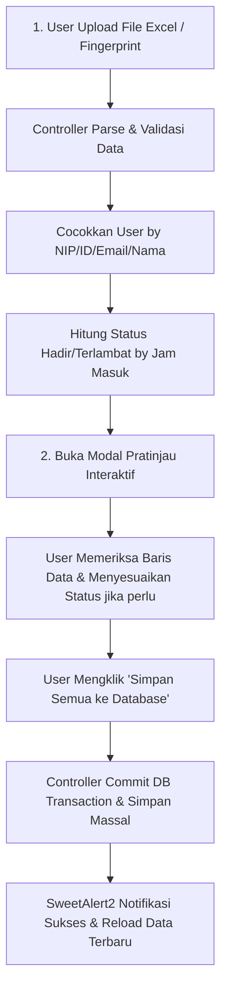

# Dokumentasi Modul Data Absensi & Inject Excel

Modul ini bertanggung jawab untuk menyimpan, mengelola, menginjek data kehadiran dari berkas Excel/CSV secara massal, serta mengekspor data absensi ke format Excel (.xlsx).

---

## 1. File Terkait
- **Controller**: `app/Http/Controllers/AttendanceController.php`
- **Model**: `app/Models/Attendance.php`
- **View**: `resources/views/attendances/index.blade.php`
- **Migrasi**: `database/migrations/2026_01_01_000005_create_attendances_table.php`
- **Pustaka Parser**: `phpoffice/phpspreadsheet` (v5.9)
- **Rute (Routes)**:
  - `GET /attendances` -> `attendances.index` (Melihat riwayat absensi & filter)
  - `POST /attendances` -> `attendances.store` (Input absensi manual)
  - `GET /attendances/template` -> `attendances.template` (Unduh berkas template `.xlsx`)
  - `POST /attendances/preview` -> `attendances.preview` (Pratinjau data Excel sebelum commit)
  - `POST /attendances/commit-import` -> `attendances.commit` (Simpan data hasil pratinjau ke database)
  - `GET /attendances/export` -> `attendances.export` (Ekspor data absensi terfilter ke `.xlsx`)
  - `GET /attendances/{attendance}/edit` -> `attendances.edit` (JSON edit data)
  - `POST /attendances/{attendance}/update` -> `attendances.update` (Simpan perubahan)
  - `DELETE /attendances/{attendance}` -> `attendances.destroy` (Hapus data absensi)

---

## 2. Format Berkas Excel yang Didukung

Sistem secara cerdas mendukung **2 Jenis Format Berkas**:

### A. Format Ekspor Mesin Fingerprint (seperti `Rekap_Fingerprint_PAUD.xlsx`)
- **Nama Sheet**: `RAW FINGERPRINT` (atau Sheet 1)
- **Kolom Utama**:
  - `ID`: ID PIN Mesin Pegawai (contoh: `7`, `2`, `10`)
  - `NAMA`: Nama Pegawai (contoh: `AISYA`, `FAUZIAH`)
  - `TANGGAL`: Format `MM/DD/YYYY` (contoh: `07/27/2026`)
  - `C-IN`: Jam Scan Masuk (contoh: `07:26:48`)
  - `C-OUT`: Jam Scan Pulang (contoh: `11:12:24`)
  - `JAM KERJA`: Keterangan / Shift Kerja (contoh: `Free OT`)

### B. Format Template Standar Sistem Absensi
- Kolom: `ID`, `NAMA`, `TANGGAL`, `C-IN`, `C-OUT`, `STATUS`, `KETERANGAN`.

---

## 3. Alur Kerja 2 Langkah: Pratinjau (Preview) & Commit

---

## 4. Fitur Interaktif Pratinjau (jQuery)
1. **Summary Badges**: Menampilkan Total Data, Data Baru Siap Masuk, Data yang Akan Ditimpa (Overwrite), dan Jumlah Pegawai Baru.
2. **Auto-Buat Akun Pegawai**: Opsi switch untuk otomatis membuat akun pegawai baru di tabel `users` jika ID/Nama pada mesin fingerprint belum terdaftar.
3. **Pencarian Live di Pratinjau**: Filter cepat nama pegawai atau tanggal langsung di dalam tabel preview.
4. **Checkbox Pilih Data**: Memungkinkan pengguna memilih semua atau sebagian baris data yang ingin diinjek.
5. **Kustomisasi Status per Baris**: Pengguna dapat mengubah status (Hadir/Terlambat/Izin/Sakit/Alpa) langsung melalui dropdown di tabel pratinjau sebelum menyimpan.
