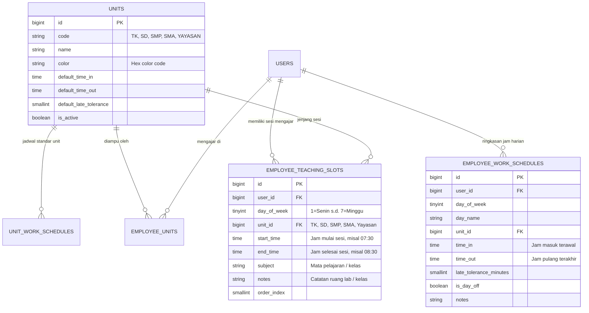

# Dokumentasi Modul: Jam Kerja Pegawai & Multi-Sesi Mengajar Yayasan

Modul **Jam Kerja Pegawai** dirancang untuk mengelola jadwal jam masuk, jam pulang, toleransi keterlambatan, dan sesi mengajar fleksibel guru di yayasan pendidikan yang menaungi 4 jenjang sekolah: **TK / PAUD**, **SD**, **SMP**, dan **SMA**, serta unit **Yayasan / Manajemen**.

---

## 1. Skenario Bisnis & Fitur Utama

### A. Jadwal Mengajar Fleksibel Multi-Sesi dalam 1 Hari (Multi-Slot per Day)
Seorang guru spesialis (misal: **Guru Bayu - Guru IT**) dalam **satu hari yang sama (misal: Senin)** dapat memiliki beberapa sesi mengajar di jenjang sekolah yang berbeda:
- **Sesi 1 (SD)**: Pukul `07:30 - 08:30` (Mapel: IT SD Kelas 4-6)
- **Sesi 2 (SMP)**: Pukul `08:30 - 09:30` (Mapel: Informatika SMP Kelas 7)
- **Sesi 3 (SMA)**: Pukul `10:00 - 11:30` (Mapel: Coding & Pemrograman SMA)

**Perhitungan Absensi Otomatis**:
- **Jam Masuk Harian**: Waktu mulai sesi paling awal pada hari tersebut (`07:30`).
- **Jam Pulang Harian**: Waktu selesai sesi paling akhir pada hari tersebut (`11:30`).
- **Total Durasi Mengajar**: Akumulasi total jam mengajar (`3 Sesi / 3 Jam`).

---

### B. Notifikasi Badge Angka untuk Pegawai Belum Diatur (Hasil Import Excel / Jadwal Kosong)
- Saat HRD mengimport data presensi dan pegawai baru melalui file Excel/CSV, data pegawai baru yang otomatis terdaftar **dibiarkan kosong jam kerjanya** terlebih dahulu.
- **Aturan Jadwal Kosong**: Jika seorang pegawai **seluruh jadwalnya dari Senin s.d. Minggu kosong** (tidak memiliki sesi mengajar dan tidak memiliki jadwal hari kerja aktif), maka sistem otomatis mengklasifikasikan pegawai tersebut sebagai **"Belum Diatur"**.
- Pada sidebar menu **"Jam Kerja Pegawai"**, sistem secara otomatis menampilkan **Badge Angka Notifikasi Berwarna Merah** (contoh: `1` atau `5`) yang menghitung jumlah pegawai aktif yang belum memiliki konfigurasi jam kerja (`get_unconfigured_schedules_count()`).
- Pada halaman utama Jam Kerja Pegawai terdapat **Banner Peringatan Khusus** dan tombol filter cepat *"Tampilkan Pegawai Belum Diatur"* untuk mempermudah HRD segera mengonfigurasi jam kerja mereka.

---

## 2. Struktur Skema Database

---

## 3. Rute dan Hak Akses (RBAC)

Kode Menu: `work-schedules`

| URL Endpoint | Method | Nama Rute | Middleware Permission | Fungsi |
|---|---|---|---|---|
| `/work-schedules` | `GET` | `work-schedules.index` | `permission:work-schedules,view` | Halaman daftar jam kerja, counter notifikasi, dan master unit |
| `/work-schedules/{user}/edit` | `GET` | `work-schedules.edit` | `permission:work-schedules,update` | Mengambil data multi-sesi harian guru via AJAX JSON |
| `/work-schedules/{user}/update` | `POST/PUT` | `work-schedules.update` | `permission:work-schedules,update` | Menyimpan penugasan unit dan daftar sesi mengajar harian guru |
| `/work-schedules/units/{unit}/update` | `POST/PUT` | `work-schedules.units.update` | `permission:work-schedules,update` | Memperbarui jam kerja standar unit yayasan |
| `/work-schedules/bulk-assign` | `POST` | `work-schedules.bulk-assign` | `permission:work-schedules,update` | Terapkan jadwal standar unit secara massal ke pegawai |
| `/work-schedules/export` | `GET` | `work-schedules.export` | `permission:work-schedules,export` | Ekspor matriks jadwal kerja dan sesi mengajar ke Excel |

---

## 4. Cara Penggunaan di Aplikasi

1. **Memantau Notifikasi Pegawai Belum Diatur**:
   - Jika terdapat angka merah pada menu **Jam Kerja Pegawai** di sidebar, klik menu tersebut.
   - Klik tombol **"Tampilkan Pegawai Belum Diatur"** pada banner peringatan.
2. **Mengatur Sesi Mengajar Multi-Slot Guru**:
   - Klik tombol **Atur** pada guru yang bersangkutan.
   - Pilih unit yang diampu (misal: TK, SD, SMP, SMA).
   - Buka tab hari yang ingin diatur (misal: **Senin**).
   - Klik tombol **`+ Tambah Sesi Mengajar`** untuk menambah slot:
     - Pilih Jenjang (contoh: `SD`), isi Jam Mulai (`07:30`), Jam Selesai (`08:30`), dan Mapel (`IT SD`).
   - **Fitur Salin Sesi Khusus (Per Jam)**:
     - Pada setiap baris sesi mengajar terdapat tombol:
       - 📋 **Salin Jam Sesi Ini**: Menyalin jam sesi spesifik tersebut ke hari kerja (Senin - Jumat) atau hari tertentu.
       - ➕ **Duplikat ke Jam Berikutnya**: Menambahkan 1 sesi baru di hari yang sama dengan jam otomatis melanjutkan (+1 jam) dan jenjang/mapel yang sama.
       - 🗑️ **Hapus**: Menghapus baris sesi mengajar tersebut.
   - **Fitur Salin Seluruh Hari**:
     - Klik tombol **`Salin ke Hari Lain...`** pada header hari untuk menduplikasi semua sesi hari tersebut sekaligus.
   - Klik **Simpan Jam Kerja Guru**.
