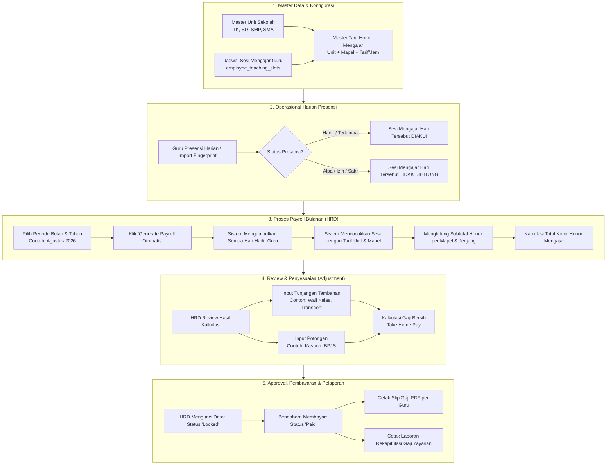
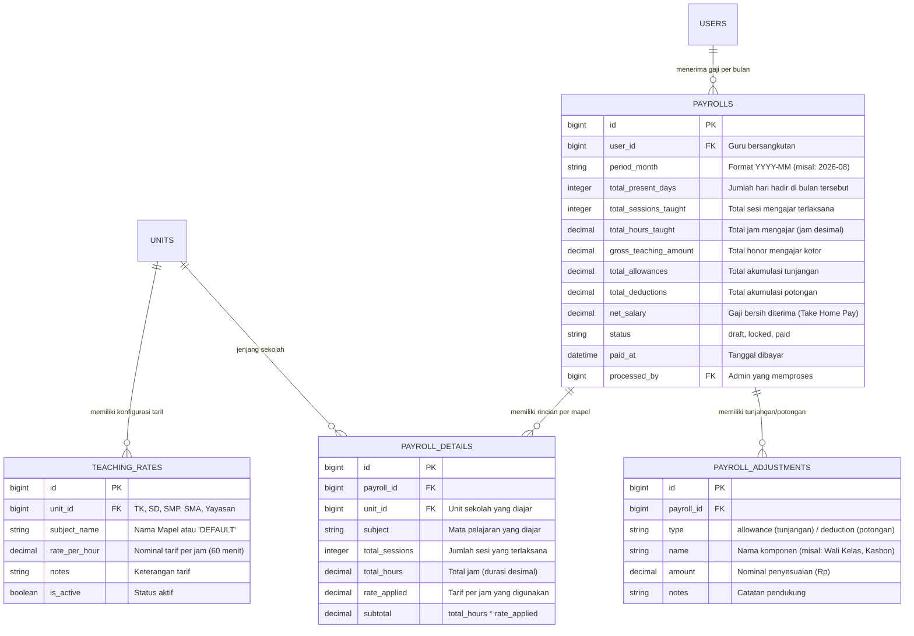

# Alur Bisnis & Proses Penggajian Guru (Honorarium Per Jam & Multi-Jenjang)

Dokumen ini menjelaskan alur bisnis (*business process*), arsitektur logika, dan formula perhitungan sistem **Penggajian / Honorarium Guru Berbasis Jam Mengajar, Jenjang Sekolah, dan Mata Pelajaran** pada yayasan pendidikan (TK, SD, SMP, SMA, dan Unit Yayasan).

---

## 1. Latar Belakang & Kebutuhan Bisnis

Di lingkungan yayasan pendidikan multi-jenjang:
1. **Guru Mengajar di Banyak Jenjang**: Seorang guru (misal: guru IT/Bahasa Inggris/Olahraga) bisa mengajar di unit **SD**, **SMP**, dan **SMA** dalam satu minggu bahkan dalam satu hari yang sama.
2. **Variasi Tarif Honor Mengajar**:
   - Tarif honor mengajar dihitung **per jam** (atau per sesi/jam pelajaran - JP).
   - Setiap jenjang sekolah memiliki standar honor yang berbeda (contoh: Tarif SMA > SMP > SD > TK).
   - Mata pelajaran tertentu (misal: Bahasa Asing, Coding/Robotik, Persiapan Olimpiade) dapat memiliki nominal honor spesifik yang berbeda dari mapel reguler.
3. **Keterikatan dengan Presensi**:
   - Honor mengajar hanya diakui dan dibayarkan pada tanggal di mana guru bersangkutan **hadir** di sekolah berdasarkan data presensi/fingerprint harian.
4. **Komponen Pelengkap**:
   - Terdapat **Tunjangan** (misal: Tunjangan Wali Kelas, Tunjangan Kehadiran Penuh, Transport).
   - Terdapat **Potongan** (misal: Keterlambatan, Kasbon Yayasan, BPJS).

---

## 2. Aktor Sistem & Peranannya

| Aktor | Peran & Tanggung Jawab dalam Penggajian |
|---|---|
| **Guru / Pendidik** | - Melakukan presensi harian (datang & pulang). - Mengajar sesuai jadwal sesi mapel & jenjang. - Melihat rincian honor dan mengunduh **Slip Gaji Digital (PDF)**. |
| **Admin HRD / Tata Usaha** | - Mengatur master **Tarif Honor Mengajar** per jenjang dan mapel. - Menjalankan fungsi **Generate Penggajian Bulanan** (1-Click Calculation). - Memverifikasi rincian jam dan menambahkan tunjangan/potongan manual. - Mengunci status gaji (*Locked*). |
| **Bendahara / Pimpinan Yayasan** | - Menyetujui (*Approval*) rekapitulasi penggajian. - Memproses pencairan dana (*Mark as Paid*). - Memantau laporan analisis biaya pengeluaran honor per jenjang sekolah. |

---

## 3. Diagram Alur Bisnis End-to-End

---

## 4. Tahapan Rinci Alur Bisnis

### Tahap 1: Pengaturan Master Tarif Honor Mengajar (`/teaching-rates`)
1. HRD membuka menu **Tarif Honor Mengajar**.
2. HRD mengatur tarif standar honor per jam untuk setiap jenjang:
   - **TK / PAUD**: Rp 30.000 / Jam
   - **SD**: Rp 35.000 / Jam
   - **SMP**: Rp 45.000 / Jam
   - **SMA**: Rp 55.000 / Jam
3. HRD dapat menambahkan **Tarif Khusus Mata Pelajaran** pada jenjang tertentu:
   - Contoh: SMA - Mapel `Coding & Pemrograman` diset Rp 75.000 / Jam.
   - *Catatan:* Jika suatu mapel tidak diset tarif khusus, sistem otomatis menggunakan tarif standar jenjang tersebut.

---

### Tahap 2: Operasional Harian Presensi
1. Data presensi masuk setiap hari (melalui mesin fingerprint atau pencatatan presensi).
2. Sistem mengecek riwayat presensi guru:
   - **Hadir / Terlambat**: Jam sesi mengajar di hari tersebut berstatus *Eligible for Payment* (Layak Dibayar).
   - **Izin / Sakit / Alpa**: Jam sesi mengajar di hari tersebut tidak dihitung sebagai jam mengajar aktif.

---

### Tahap 3: Periode Tutup Buku & Generate Payroll Bulanan (`/payrolls`)
1. Setiap akhir bulan (misal tanggal 25 atau akhir bulan), HRD membuka menu **Penggajian / Payroll**.
2. HRD memilih periode bulan (misal: `Agustus 2026`) dan menekan tombol **"Hitung Gaji Otomatis"**.
3. Sistem secara otomatis melakukan kalkulasi:
   $$\text{Honor Sesi} = \text{Durasi Jam (60 Menit)} \times \text{Tarif Berlaku (Unit \& Mapel)}$$
   $$\text{Total Honor Kotor} = \sum (\text{Honor Semua Sesi Terlaksana dalam 1 Bulan})$$
4. Sistem membuat draf penggajian untuk setiap guru aktif.

---

### Tahap 4: Review dan Input Penyesuaian (Tunjangan & Potongan)
1. HRD membuka detail penggajian seorang guru.
2. HRD dapat melihat transparansi rincian:
   - Berapa kali mengajar di SD, SMP, dan SMA.
   - Mapel apa saja yang diajarkan beserta total jam dan subtotal rupiahnya.
3. HRD dapat menambahkan penyesuaian:
   - **Tunjangan (+)**: Misal Tunjangan Wali Kelas Rp 300.000.
   - **Potongan (-)**: Misal Potongan Kasbon Koperasi Rp 100.000.
4. Gaji Bersih (*Take Home Pay*) otomatis terbarui secara *real-time*.

---

### Tahap 5: Finalisasi, Pembayaran & Distribusi Slip Gaji
1. **Status Draft $\rightarrow$ Locked**: Setelah diverifikasi HRD, data dikunci agar aman dari perubahan presensi susulan.
2. **Status Locked $\rightarrow$ Paid**: Setelah dana ditransfer oleh Bendahara, status diubah menjadi *Sudah Dibayar*.
3. **Distribusi Slip Gaji**:
   - Guru dapat mengunduh **Slip Gaji PDF** resmi berformat rapi.
   - Yayasan dapat mencetak **Laporan Rekap Biaya Penggajian Yayasan** (Total beban biaya per unit SD, SMP, SMA).

---

## 5. Studi Kasus Simulasi Perhitungan

### Data Guru: **Pak Bayu, S.Kom** (Guru IT Multi-Jenjang)
Periode: **Agustus 2026** (Total 4 Minggu Aktif)

#### A. Jadwal Mingguan Pak Bayu:
- **Senin**:
  - `07:30 - 08:30` (1 Jam) $\rightarrow$ **SD** - Mapel *IT Dasar* (Tarif: Rp 35.000/jam)
  - `08:30 - 09:30` (1 Jam) $\rightarrow$ **SMP** - Mapel *Informatika* (Tarif: Rp 45.000/jam)
  - `10:00 - 11:30` (1.5 Jam) $\rightarrow$ **SMA** - Mapel *Coding Web* (Tarif Khusus: Rp 75.000/jam)
- **Rabu**:
  - `08:00 - 10:00` (2 Jam) $\rightarrow$ **SMP** - Mapel *Informatika* (Tarif: Rp 45.000/jam)

#### B. Rekap Kehadiran Pak Bayu dalam 1 Bulan:
- Hari Senin: Hadir 4 kali (100% hadir).
- Hari Rabu: Hadir 3 kali, Izin 1 kali.

#### C. Kalkulasi Realisasi Jam & Honor:

| Unit Sekolah | Mata Pelajaran | Sesi Terlaksana | Total Jam | Tarif / Jam | Subtotal Honor |
|---|---|---|---|---|---|
| **SD** | IT Dasar | 4 sesi | 4.0 Jam | Rp 35.000 | **Rp 140.000** |
| **SMP** | Informatika | 4 sesi (Senin) + 3 sesi (Rabu) = 7 sesi | 10.0 Jam | Rp 45.000 | **Rp 450.000** |
| **SMA** | Coding Web | 4 sesi | 6.0 Jam | Rp 75.000 | **Rp 450.000** |
| **TOTAL HONOR MENGAJAR** | | **15 Sesi** | **20.0 Jam** | | **Rp 1.040.000** |

#### D. Komponen Penyesuaian Tambahan:
- **Tunjangan (+)**:
  - Tunjangan Kepala Lab Komputer: `+Rp 400.000`
  - Tunjangan Kehadiran: `+Rp 150.000`
- **Potongan (-)**:
  - Potongan Iuran Sosial Yayasan: `-Rp 50.000`

#### E. Total Gaji Bersih (Take Home Pay):
$$\text{Take Home Pay} = \text{Rp } 1.040.000 + \text{Rp } 550.000 - \text{Rp } 50.000 = \mathbf{Rp\ 1.540.000}$$

---

## 6. Struktur Skema Database yang Diperlukan

---

## 7. Rencana Rute Menu & Hak Akses (RBAC)

| Kode Menu | URL Endpoint | Metode | Izin RBAC | Fungsi |
|---|---|---|---|---|
| `teaching-rates` | `/teaching-rates` | `GET` | `view` | Halaman kelola matriks tarif honor per jenjang & mapel |
| `teaching-rates` | `/teaching-rates` | `POST` | `create` | Menambah tarif mapel/jenjang baru |
| `teaching-rates` | `/teaching-rates/{rate}` | `PUT` | `update` | Memperbarui nominal tarif per jam |
| `teaching-rates` | `/teaching-rates/{rate}` | `DELETE` | `delete` | Menghapus aturan tarif khusus |
| `payrolls` | `/payrolls` | `GET` | `view` | Daftar rekap gaji bulanan & filter periode |
| `payrolls` | `/payrolls/generate` | `POST` | `create` | Proses kalkulasi otomatis seluruh guru |
| `payrolls` | `/payrolls/{payroll}` | `GET` | `view` | Detail breakdown jam mengajar, tunjangan & potongan |
| `payrolls` | `/payrolls/{payroll}/adjustments` | `POST` | `update` | Menambah tunjangan/potongan pada gaji guru |
| `payrolls` | `/payrolls/{payroll}/status` | `PUT` | `update` | Mengubah status: Draft $\rightarrow$ Locked $\rightarrow$ Paid |
| `payrolls` | `/payrolls/{payroll}/slip-pdf` | `GET` | `export` | Cetak Slip Gaji Guru (PDF A4/A5) |
| `payrolls` | `/payrolls/export-summary` | `GET` | `export` | Ekspor rekapitulasi gaji yayasan ke Excel & PDF |
